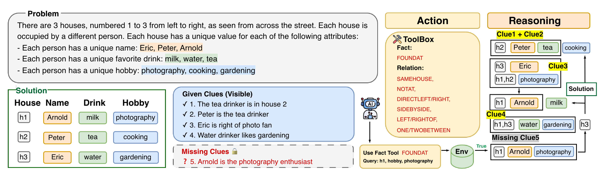

# ZebraArena

A diagnostic environment for studying reasoning–action coupling in tool-augmented LLMs on Zebra (logic) puzzles. ZebraArena features controllable difficulty and a knowledge-minimal design that limits gains from memorization or dataset contamination.
ZebraArena measures how effectively models reason under varying information constraints, query budgets, and token pricing signals. Each task in ZebraArena requires a set of critical information which is available only through targeted tool use, yielding an interpretable interface between external information acquisition and deductive reasoning. This design provides deterministic evaluation via unique solutions, and a theoretical optimal query count for measuring efficient tool use. 
 
## Overview


Zebra puzzles (logic grid puzzles) can be viewed as **constraint satisfaction problems (CSPs)**: assign values (e.g., Name/Color/Food/Animal) to `N` houses under **all-different** constraints and a set of logical clues.


### 1) Full-clues (standard) setting
- The model receives the complete clue set `C_full`.
- The puzzle is **uniquely solvable**; evaluation is deterministic against the single ground-truth solution.

### 2) Our Missing-clues setting
- The model receives an incomplete clue set `C_0 ⊂ C_full`, which is **not sufficient for uniqueness**.
- The model must query the environment to recover missing constraints and solve the puzzle.

#### Supported query types
- **Fact queries**: ask whether a specific assignment is true  
  Example: “Is the red house at position 1?”
- **Relation queries**: ask whether a relationship between houses/attributes holds  
  Example: “Is house 1 directly left of house 2?”

The environment returns **ground-truth answers**. The model must integrate these answers with `C_0` to converge to the unique solution, enabling fine-grained analysis of **how models acquire information and use it for multi-step deductive reasoning**.

#### Output format (for logging / analysis)
- Reasoning is wrapped in `<think>...</think>`
- Queries are wrapped in `<query>...</query>`
- Final solutions are wrapped in `<solution>...</solution>`

## Project Structure

```
ZebraArena/
├── core/                              # Core solver framework and LLM integration
│   ├── base_solver.py                 # Abstract base solver with extensible hooks
│   ├── llm.py                         # Multi-provider LLM interface
│   └── utils.py                       # Serialization utilities
├── env/                               # Environment and query execution
│   ├── scheme.py                      # Query schema, validation, canonicalization
│   └── response_server.py             # Ground-truth query execution engine
├── experiments/                       # Three experimental setups
│   ├── exp1_basic/                    # Experiment 1: Baseline evaluation
│   ├── exp2_budget/                   # Experiment 2: Budget-constrained solving
│   └── exp3_token_price/              # Experiment 3: Token pricing optimization
├── extract/                           # Output parsing and evaluation
│   ├── extract_query.py               # Query/answer extraction from LLM output
│   └── grid_reward.py                 # Solution validation and scoring
├── prompts/                           # Prompt templates
│   └── base_prompt.py                 # Environment-specific prompt templates
└── utils/                             # Shared utilities
    └── prune_messages.py              # Context window management
```

## Experiments

### Experiment 1: Basic Evaluation (`exp1_basic/`)

Evaluates how well models solve puzzles under three **environment types** that control which query types are available:

| Environment | Allowed Queries | Description |
|-------------|----------------|-------------|
| `normal` | Fact + Relation | Full query access |
| `only_fact` | Fact only | No spatial/relational queries |
| `only_relation` | Relation only | No direct attribute lookups |

Puzzles span three difficulty levels based on puzzle **space size** (Small, Medium, Large) and **number of missing clues** (1-4).

```bash
python experiments/exp1_basic/run.py \
    --env_type normal \
    --miss_num 2 \
    --space Medium \
    --model gpt-5-mini \
    --num_processes 16 \
    --dataset_dir /path/to/dataset \
    --log_dir /path/to/logs
```

### Experiment 2: With Budget Constraints  (`exp2_budget/`)

Tests how models perform when given a limited **query budget**. The budget is communicated in the prompt, and the model must solve the puzzle within the allowed number of tool calls.

Three budget levels derived from Experiment 1 results:

| Budget Level | Definition |
|-------------|-----------|
| **Tight** | K* (minimum missing clues) |
| **Normal** | Average information retrieval from Exp1 |
| **Relaxed** | a larger budget |


```bash
python experiments/exp2_budget/run.py \
    --budget_level normal \
    --miss_num 1 \
    --space Medium \
    --model gpt-5-mini
```

### Experiment 3: With Token Pricing Signal (`exp3_token_price/`)

Investigates whether pricing signals affect model query strategies. Each query type is assigned a virtual token cost, and the model sees cumulative usage after each turn:

```
[Token usage: 1200 reasoning + 1500 tools = 2700 total]
```

Nine pricing conditions test different cost ratios (For Gemini-2.5-Flash):


| Condition            | Fact Price | Relation Price | Fact:Relation |
|---------------------|-----------:|---------------:|:-------------:|
| Baseline            |        500 |            500 |      1:1      |
| Fact-Cheap          |        250 |            500 |      1:2      |
| Fact-Expensive      |       1000 |            500 |      2:1      |
| Relation-Cheap      |        500 |            250 |      2:1      |
| Relation-Expensive  |        500 |           1000 |      1:2      |
| Both-Cheap          |        250 |            250 |      1:1      |
| Both-Expensive      |       1000 |           1000 |      1:1      |
| Fact-Very-Cheap     |        100 |           2000 |     1:20      |
| Fact-Very-Expensive |       2000 |            100 |     20:1      |
| Tool-Free           |          0 |              0 |      1:1      |

```bash
python experiments/exp3_token_price/run.py \
    --pricing_condition baseline \
    --miss_num 2 \
    --space Medium \
    --model gpt-5-mini
```

## Query Protocol

Models interact with the environment through structured JSON queries.

### Fact Query

Ask whether a specific attribute value is assigned to a specific house:

```json
{
    "type": "fact",
    "rel": "found_at",
    "house": "h1",
    "attr": "Color",
    "value": "red"
}
```

### Relation Query

Ask about spatial or logical relationships between two houses:

```json
{
    "type": "relation",
    "rel": "direct_left",
    "lhs": {"house": "h1"},
    "rhs": {"house": "h2"}
}
```

**Supported relations:** `same_house`, `not_at`, `direct_left`, `direct_right`, `side_by_side`, `left_of`, `right_of`, `one_between`, `two_between`

All queries are canonicalized (case-insensitive, whitespace-normalized) and validated against JSON schemas before execution.


### Environment Variables

Set the API key for your chosen provider:

```bash
export OPENAI_API_KEY="your-key"    # OpenAI
export GEMINI_API_KEY="your-key"    # Gemini (default provider)
export TOGETHER_API_KEY="your-key"  # Together AI
```

